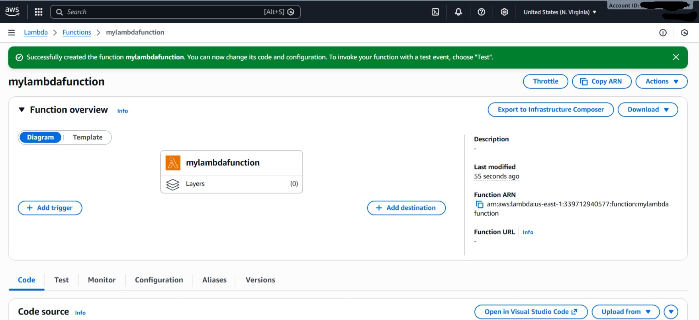
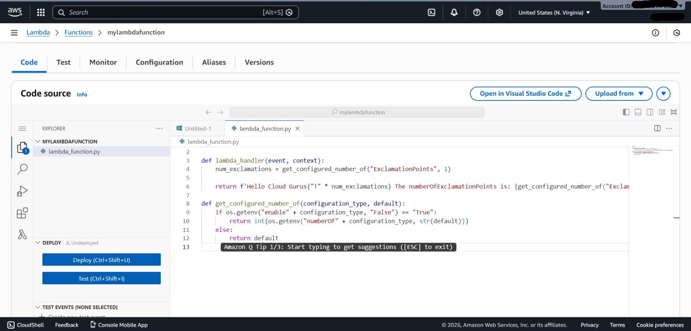
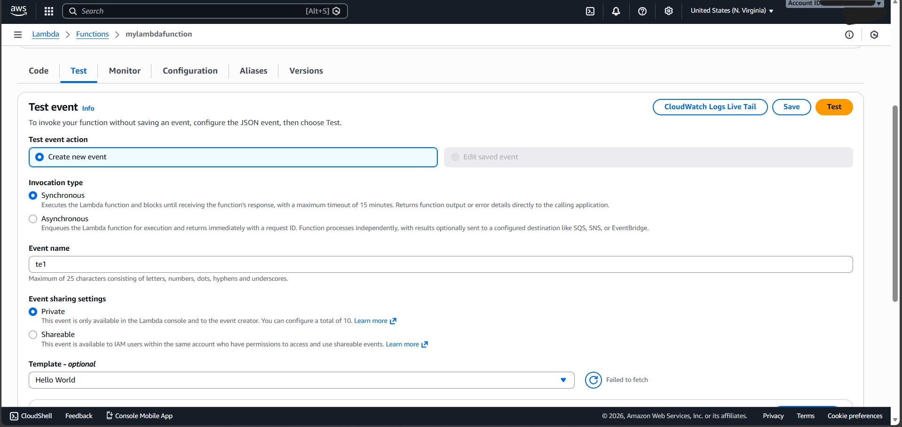
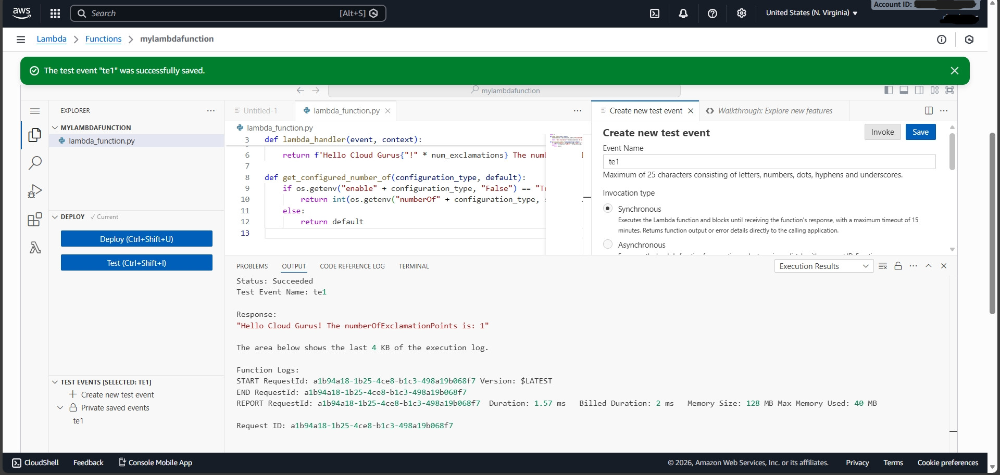
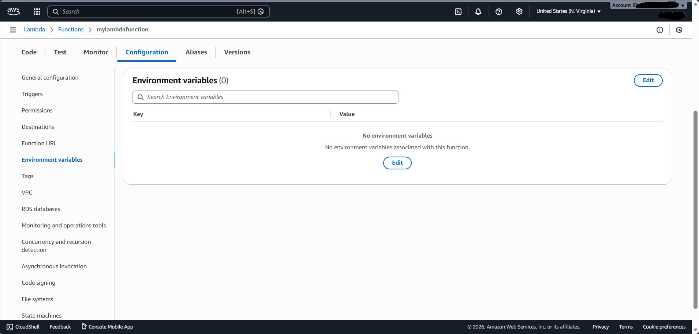
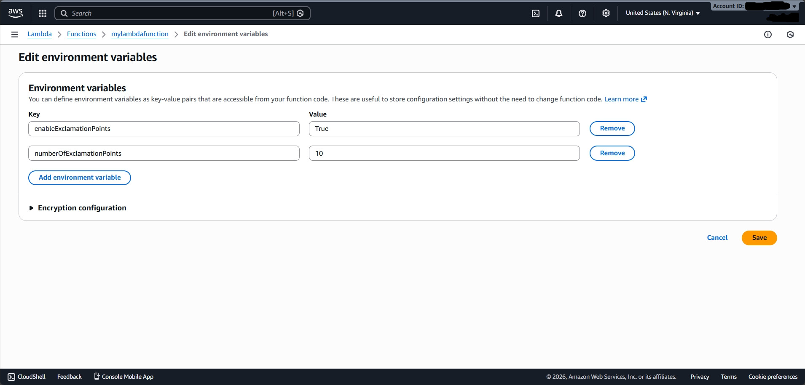
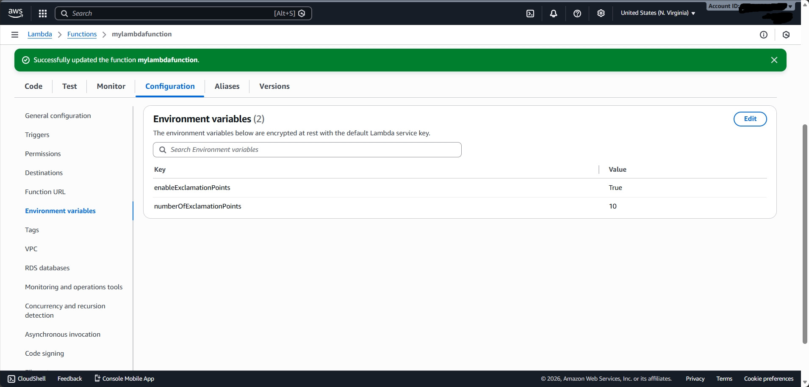
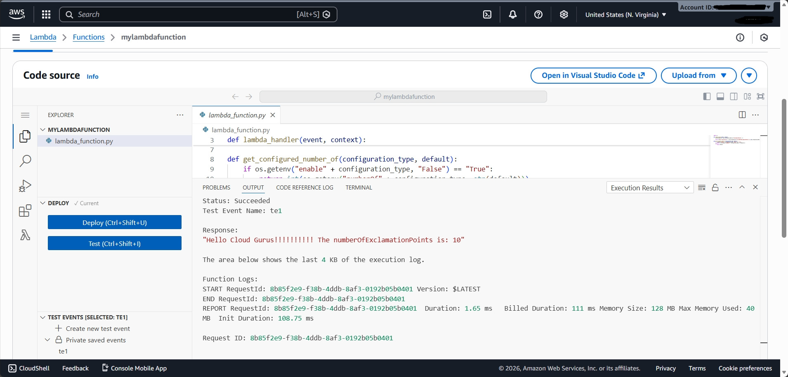

# Configuring-a-Lambda-Function-Using-Environment-Variables-and-Parameters

This lab demonstrates how to configure AWS Lambda environment variables to change the behavior of a Lambda function without modifying or redeploying the code.
The function behavior is controlled using user-defined key–value pairs from the Configuration tab.

## Objective

- Create an AWS Lambda function using Python
- Test the function with default settings
- Configure environment variables
- Modify function output dynamically
- Understand Lambda configuration options

## Prerequisites

- AWS Account
- Basic AWS Console knowledge
- Python runtime (AWS managed)
- Internet access

 ## Step 1: Open AWS Lambda Service and Create a Function

1. Sign in to the **AWS Management Console**
2. Search for **Lambda** and open the service
 

  

3. Click **Create function**
 

 

4. Select **Author from scratch**
5. Enter a function name (example: mylambdafunction)
6. Choose **Python** (latest version) as runtime
7. Select **x86_64** architecture
 

 

  

8. Click **Create function**
 

 

  

## Step 2: Add Python Code and Deploy the Function

1. After the function is created, the Lambda dashboard is displayed.
 

 

  

2. Scroll down to the **Code source** section.
3. Remove the default sample code.
4. Paste the provided Python code into `lambda_function.py`.
5. Click **Deploy** to save the changes.
 

 

  

## Step 3: Test the Lambda Function with Default Settings

1. Click the **Test** tab.
2. Create a new test event.
3. Enter the event name.
4. Use the default event template.
5. Click **Save**.
 

 

  

6. Click **Test** to execute the function.
7. Verify that the output displays **one exclamation point**.
 

 

  

## Step 4: Configure Environment Variables

1. Click the **Configuration** tab.
2. Select **Environment variables** from the left menu.
3. Click **Edit**.
 

 

  

4. Add the environment variable `enableExclamationPoints` with value `True`.
5. Add the environment variable `numberOfExclamationPoints` with value `10`.
6. Ensure variable names are **case-sensitive**.
7. Click **Save**.
 

 

  

8. Confirm that the environment variables are successfully saved and displayed, indicating that the configuration is complete.
 

 

  

## Step 5: Test the Lambda Function After Configuration

1. Navigate back to the **Test** tab.
2. Click **Test** to run the function again.
3. Verify that the output now displays **10 exclamation points**.
 

 

  

## Key Observations

- Environment variables allow dynamic configuration of Lambda functions.
- Function behavior can be changed without redeployment.
- Variable names are **case-sensitive**.
- The Configuration tab allows:
  - Memory and storage configuration
  - Trigger management
  - Permissions and VPC access
  - Monitoring and concurrency settings

## Conclusion

This lab demonstrates how **AWS Lambda environment variables** can be used to dynamically control application behavior.  
Separating configuration from code improves flexibility, maintainability, and scalability in serverless applications.
