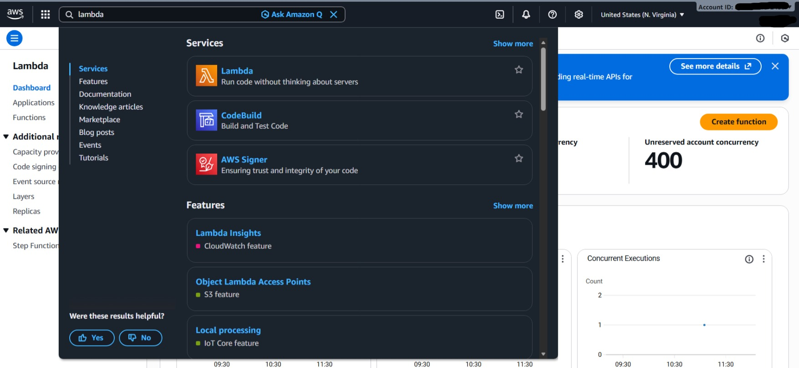
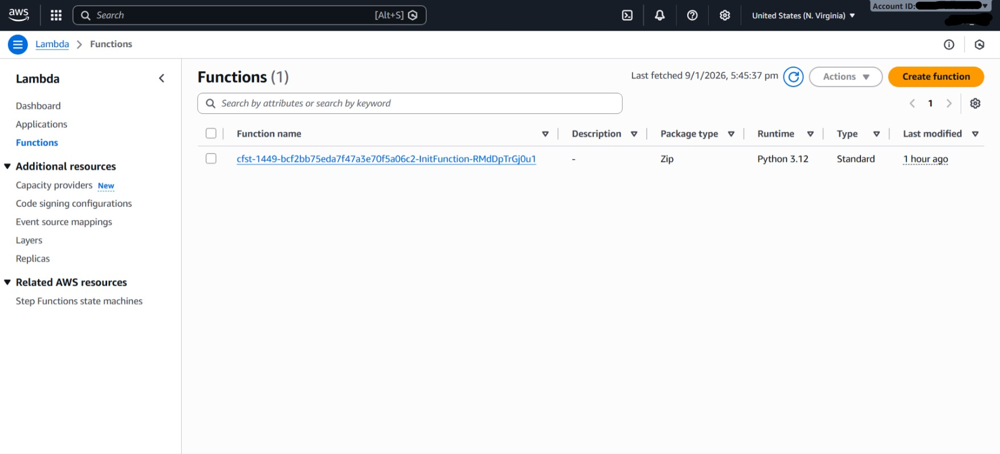
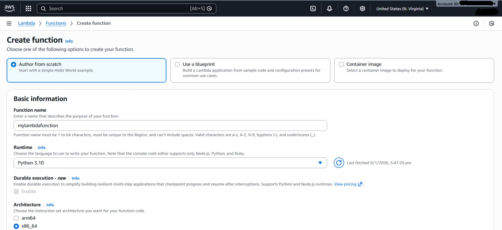
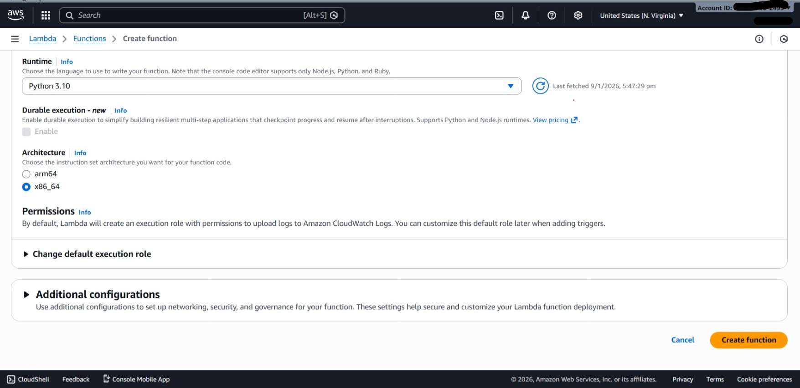

# Configuring-a-Lambda-Function-Using-Environment-Variables-and-Parameters

This lab demonstrates how to configure AWS Lambda environment variables to change the behavior of a Lambda function without modifying or redeploying the code.
The function behavior is controlled using user-defined key–value pairs from the Configuration tab.

## Objective

- Create an AWS Lambda function using Python
- Test the function with default settings
- Configure environment variables
- Modify function output dynamically
- Understand Lambda configuration options

## Prerequisites

- AWS Account
- Basic AWS Console knowledge
- Python runtime (AWS managed)
- Internet access

 ## Step 1: Open AWS Lambda Service and Create a Function

1. Sign in to the **AWS Management Console**
2. Search for **Lambda** and open the service
 

  

3. Click **Create function**
 

 

4. Select **Author from scratch**
5. Enter a function name (example: mylambdafunction)
6. Choose **Python** (latest version) as runtime
7. Select **x86_64** architecture
 

 

  

8. Click **Create function**
 

 

  

